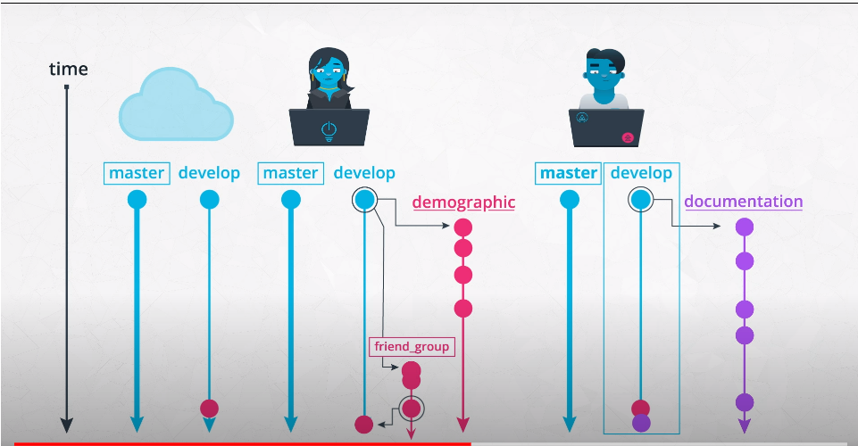
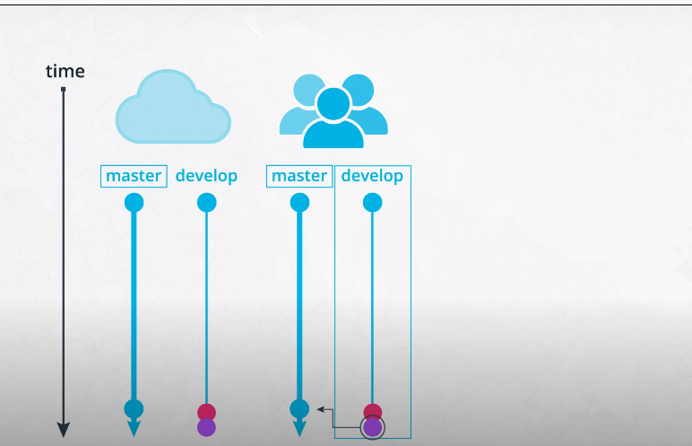

### Scenario #3 Git Merging branches on a team.

Let's walk through the git commands that go along with each step in the scenario you just observed in the images below.

Step 1 and Step 2: 
  

Step 3: 

**Step 1: Andrew commits his changes to the documentation branch, switches to the development branch, and pulls down the latest changes
from the cloud on this development branch, including the change I merged previously for the friends group feature.**

> **Commit changes on documentation branch**  
> `git commit -m "standardized all docstrings in process.py"`

> **Switch to develop branch**  
> `git checkout develop`

> **Pull latest changes on develop down**  
> `git pull`

**Step 2: Then, Andrew merges his documentation branch on the develop branch on his local repository, and then pushes his 
changes up to update the develop branch on the remote repository.**

> **Merge documentation branch to develop**  
> `git merge --no-ff documentation`

> **Push changes up to remote repository**  
> `git push origin develop`

**Step 3: After the team reviewed both of your work, they merge the updates from the development branch to the master branch.
Now they push the changes to the master branch on the remote repository. These changes are now in production.**

> **Merge develop to master**  
> `git merge --no-ff develop` 

> **Push changes up to remote repository**  
> `git push origin master`  

#### Resources
There's a great article on a successful git branching strategy that you should really read [here](https://nvie.com/posts/a-successful-git-branching-model/).

#### Note on Merge Conflicts
For the most part, git makes merging changes between branches really simple. However, there are some cases where git will be confused on how to combine two changes, and asks you for help. This is called a merge conflict.

Mostly commonly, this happens when two branches modify the same file.

For example, in this situation, let’s say I deleted a line that Andrew modified on his branch. Git wouldn’t know whether to delete the line or modify it. Here, you need to tell git which change to take, and some tools even allow you to edit the change manually. If it isn’t straightforward, you may have to consult with the developer of the other branch to handle a merge conflict.

You can learn more about merge conflicts and methods to handle them [here](https://help.github.com/en/github/collaborating-with-issues-and-pull-requests/about-merge-conflicts).
