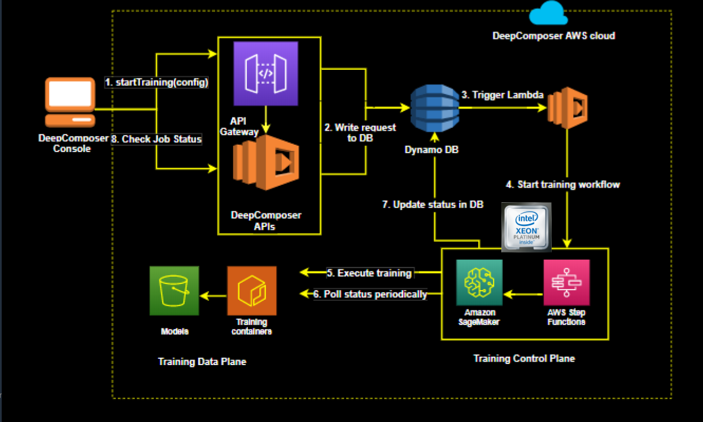
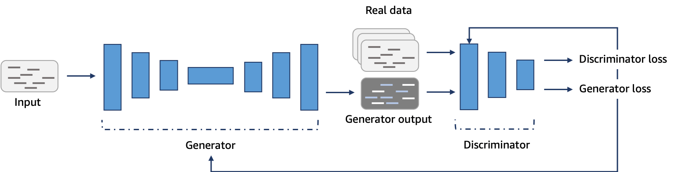

### 1. Introduction

In this lesson you'll get an introduction to Machine Learning. You will learn about Generative AI and AWS DeepComposer. You'll also learn how to build a custom Generative Adversarial Network.

    
### 2. AWS Account Requirements

### 3. Why Machine Learning on AWS

#### AWS Mission
Put machine learning in the hands of every developer.

#### Why AWS?
* AWS offers the broadest and deepest set of AI and ML services with unmatched flexibility.
* You can accelerate your adoption of machine learning with AWS SageMaker. Models that previously took months and required specialized expertise can now be built in weeks or even days.
* AWS offers the most comprehensive cloud offering optimized for machine learning.
* More machine learning happens at AWS than anywhere else.

#### More Relevant Enterprise Search With Amazon Kendra
* Natural language search with contextual search results
* ML-optimized index to find more precise answers
* 20+ Native Connectors to simplify and accelerate integration
* Simple API to integrate search and easily develop search applications
* Incremental learning through feedback to deliver up-to-date relevant answers

#### Online Fraud Detection with Amazon Fraud Detector
* Pre-built fraud detection model templates
* Automatic creation of custom fraud detection models
* One interface to review past evaluations and detection logic
* Models learn from past attempts to defraud Amazon
* Amazon SageMaker integration

#### Better Insights And Customer Service With Contact Lens
* Identify common call types
* Identify recurring themes based on customer call feedback
* Alert supervisors when customers are having a poor experience
* Assist agents with a knowledge base to answer questions as they are being asked

#### How to Get Started?
* [AWS DeepLens](https://aws.amazon.com/deeplens/): deep learning and computer vision
* [AWS DeepRacer](https://aws.amazon.com/deepracer/) and the [AWS DeepRacer League](https://aws.amazon.com/deepracer/league/): reinforcement learning
* [AWS DeepComposer](https://aws.amazon.com/deepcomposer/): Generative AI.
* [AWS ML Training and Certification](https://aws.amazon.com/training/learning-paths/machine-learning/): Curriculum used to train Amazon developers
* Partnerships with Online Learning Providers: Including this course and the Udacity [AWS DeepRacer course](https://www.udacity.com/course/aws-deepracer--ud014)!

### 4. ML Techniques and Generative AI

#### Machine Learning Techniques
1. Supervised Learning: Models are presented wit input data and the desired results. The model will then attempt to learn rules that map the input data to the desired results.
2. Unsupervised Learning: Models are presented with datasets that have no labels or predefined patterns, and the model will attempt to infer the underlying structures from the dataset. Generative AI is a type of unsupervised learning.
3. Reinforcement learning: The model or agent will interact with a dynamic world to achieve a certain goal. The dynamic world will reward or punish the agent based on its actions. Overtime, the agent will learn to navigate the dynamic world and accomplish its goal(s) based on the rewards and punishments that it has received.

#### Generative AI
Generative AI is one of the biggest recent advancements in artificial intelligence technology because of its ability to create something new. It opens the door to an entire world of possibilities for human and computer creativity, with practical applications emerging across industries, from turning sketches into images for accelerated product development, to improving computer-aided design of complex objects. It takes two neural networks against each other to produce new and original digital works based on sample inputs.

### 5. AWS Deep Composer

AWS Deep Composer uses Generative AI, or specifically Generative Adversarial Networks (GANs), to generate music. GANs pit 2 networks, a generator and a discriminator, against each other to generate new content.

The best way we’ve found to explain this is to use the metaphor of an orchestra and conductor. In this context, the generator is like the orchestra and the discriminator is like the conductor. The orchestra plays and generates the music. The conductor judges the music created by the orchestra and coaches the orchestra to improve for future iterations. So an orchestra, trains, practices, and tries to generate music, and then the conductor coaches them to produced more polished music.

GANS is Similar to an Orchestra and a Conductor: The More They Work Together, the Better They Can Perform!

#### AWS DeepComposer Workflow
Use the AWS DeepComposer keyboard or play the virtual keyboard in the AWS DeepComposer console to input a melody.

Use a model in the AWS DeepComposer console to generate an original musical composition. You can choose from jazz, rock, pop, symphony or Jonathan Coulton pre-trained models or you can also build your own custom genre model in Amazon SageMaker.

Publish your tracks to SoundCloud or export MIDI files to your favorite Digital Audio Workstation (like Garage Band) and get even more creative.

### 6. Compose Music with AWS DeepComposer Models
Now that you know a little more about AWS DeepComposer including its workflow and what GANs are, let’s compose some music with AWS DeepComposer models. We’ll begin this demonstration by listening to a sample input and a sample output, then we’ll explore DeepComposer’s music studio, and we’ll end by generating a composition with a 4 part accompaniment.

1. To get to the main AWS DeepComposer console, navigate to AWS DeepComposer. Make sure you are in the US East-1 region.
2. Once there, click on Get started
3. In the left hand menu, select Music studio to navigate to the DeepComposer music studio
4. To generate music you can use a virtual keyboard or the physical AWS DeepComposer keyboard. For this lab, we’ll use the virtual keyboard.
5. To view sample melody options, select the drop down arrow next to Input
6. Select Twinkle, Twinkle, Little Star
7. Next, choose a model to apply to the melody by clicking Select model
8. From the sample models, choose Rock and then click Select model
9. Next, select Generate composition. The model will take the 1 track melody and create a multitrack composition (in this case, it created 4 tracks)
10. Click play to hear the output

Now that you understand a little about the DeepComposer music studio and created some AI generated music, let’s move on to an exercise for generating an interface. There, you’ll have an opportunity to clone a pre-trained model to create your AI generated music!

### 7. Exercise: Generate an Interface

### 8. How DeepComposer Works:

#### AWS DeepComposer uses a GAN

Each iteration of the training cycle is called an epoch. The model is trained for thousands of epochs.

#### Loss Functions
In machine learning, the goal of iterating and completing epochs is to improve the output or prediction of the model. Any output that deviates from the ground truth is referred to as an error. The measure of an error, given a set of weights, is called a loss function. Weights represent how important an associated feature is to determining the accuracy of a prediction, and loss functions are used to update the weights after every iteration. Ideally, as the weights update, the model improves making less and less errors. Convergence happens once the loss functions stabilize.

We use loss functions to measure how closely the output from the GAN models match the desired outcome. Or, in the case of DeepComposer, how well does DeepComposer's output music match the training music. Once the loss functions from the Generator and Discriminator converges, this indicates the GAN model is no longer learning, and we can stop its training.

We also measures the quality of the music generated by DeepComposer via additional quantitative metrics, such as drum pattern and polyphonic rate.

GAN loss functions have many fluctuations early on due to the “adversarial” nature of the generator and discriminator.

Over time, the loss functions stabilizes to a point, we call this convergence. This convergence can be zero, but doesn’t have to be.

#### AWS DeepComposer under the hood

#### How It Works
1. Input melody captured on the AWS DeepComposer console
2. Console makes a backend call to AWS DeepComposer APIs that triggers an execution Lambda.
3. Book-keeping is recorded in Dynamo DB.
4. The execution Lambda performs an inference query to SageMaker which hosts the model and the training inference container.
5. The query is run on the Generative AI model.
6. The model generates a composition.
7. The generated composition is returned.
8. The user can hear the composition in the console.
9. The user can share the composition to SoundCloud.

### 9. Training Architecture

#### How to measure the quality of the music we’re generating:

1. We can monitor the loss function to make sure the model is converging
2. We can check the similarity index to see how close is the model to mimicking the style of the data. When the graph of the similarity index smoothes out and becomes less spikey, we can be confident that the model is converging
3. We can listen to the music created by the generated model to see if it's doing a good job. The musical quality of the model should improve as the number of training epochs increases.

#### Training architecture

1. User launch a training job from the AWS DeepComposer console by selecting hyperparameters and data set filtering tags
2. The backend consists of an API Layer (API gateway and lambda) write request to DynamoDB
3. Triggers a lambda function that starts the training workflow
4. It then uses AWS Step Funcitons to launch the training job on Amazon SageMaker
5. Status is continually monitored and updated to DynamoDB
6. The console continues to poll the backend for the status of the training job and update the results live so users can see how the model is learning

#### Challenges with GANs:

1. Clean datasets are hard to obtain 
2. Not all melodies sound good in all genres 
3. Convergence in GAN is tricky – it can be fleeting rather than being a stable state 
4. Complexity in defining meaningful quantitive metrics to measure the quality of music created 

### 10. Generative AI

Generative AI has been described as one of the most promising advances in AI in the past decade by the MIT Technology Review.

Generative AI opens the door to an entire world of creative possibilities with practical applications emerging across industries, from turning sketches into images for accelerated product development, to improving computer-aided design of complex objects.

For example, Glidewell Dental is training a generative adversarial network adept at constructing detailed 3D models from images. One network generates images and the second inspects those images. This results in an image that has even more anatomical detail than the original teeth they are replacing.

Generative AI enables computers to learn the underlying pattern associated with a provided input (image, music, or text), and then they can use that input to generate new content. Examples of Generative AI techniques include Generative Adversarial Networks (GANs), Variational Autoencoders, and Transformers.

#### What are GANs?
GANs, a generative AI technique, pit 2 networks against each other to generate new content. The algorithm consists of two competing networks: a generator and a discriminator.

A **generator** is a convolutional neural network (CNN) that learns to create new data resembling the source data it was trained on.

The **discriminator** is another convolutional neural network (CNN) that is trained to differentiate between real and synthetic data.

The generator and the discriminator are trained in alternating cycles such that the generator learns to produce more and more realistic data while the discriminator iteratively gets better at learning to differentiate real data from the newly created data.

#### Like the collaboration between an orchestra and its conductor
The best way we’ve found to explain this is to use the metaphor of an orchestra and conductor. An orchestra doesn’t create amazing music the first time they get together. They have a conductor who both judges their output, and coaches them to improve. So an orchestra, trains, practices, and tries to generate polished music, and then the conductor works with them, as both judge and coach.

The conductor is both judging the quality of the output (were the right notes played with the right tempo) and at the same time providing feedback and coaching to the orchestra (“strings, more volume! Horns, softer in this part! Everyone, with feeling!”). Specifically to achieve a style that the conductor knows about. So, the more they work together the better the orchestra can perform.

The Generative AI that AWS DeepComposer teaches developers about uses a similar concept. We have two machine learning models that work together in order to learn how to generate musical compositions in distinctive styles.

The following lessons with the video lectures gives better insights:

* 11. Introduction to U-Net Architecture
* 12. Model Architecture
* 13. Training Methodology
* 14. Evaluation
* 15. Inference
* 16. Building a Custom GAN Part 1: Notebooks and Data Preparation
* 17. Building a Custom GAN Part 2: Training and Evaluation
* 18. Lesson- Recap
